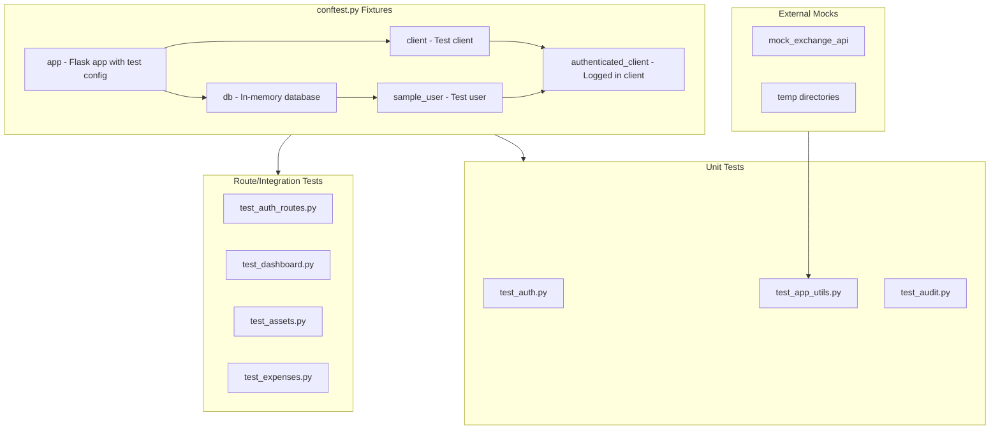

# Unit Testing Plan for CMP Flask Application

## Overview

This plan outlines the strategy for implementing unit tests and route/integration tests for the CMP (Club Management Platform) Flask application.

## Testing Framework

**pytest** is recommended as the primary testing framework because:
- Excellent Flask support via `pytest-flask`
- Powerful fixture system for database and app setup
- Built-in parametrization for data-driven tests
- Rich plugin ecosystem (pytest-cov, pytest-mock)

## Proposed Test Structure (Phase 1: Unit Tests Only)

```
tests/
├── __init__.py              # Makes tests a package
├── conftest.py              # Shared fixtures (app, db)
├── test_auth.py             # Tests for auth.py
├── test_app_utils.py        # Tests for utility functions in app.py
└── test_audit.py            # Tests for audit.py
```

> **Note:** Route/integration tests will be added in Phase 2.

## Dependencies to Add

Add these to `pyproject.toml` under dev dependencies:

```toml
[project.optional-dependencies]
dev = [
    "pytest>=8.0.0",
    "pytest-flask>=1.3.0",
    "pytest-cov>=4.1.0",
    "pytest-mock>=3.12.0",
]
```

## Test Categories

### 1. Unit Tests - Utility Functions

#### [`src/auth.py`](../src/auth.py)

| Function | Test Cases |
|----------|------------|
| `validateUser(username, password)` | Valid credentials returns user |
| | Invalid username returns None |
| | Invalid password returns None |
| | Empty credentials returns None |

#### [`src/app.py`](../src/app.py)

| Function | Test Cases |
|----------|------------|
| `allowed_file(filename)` | Returns True for valid extensions (png, jpg, pdf, etc.) |
| | Returns False for invalid extensions |
| | Returns False for no extension |
| | Returns False for empty filename |
| `save_upload(file)` | Saves valid file and returns filename |
| | Returns None for invalid file type |
| | Returns None for no file |
| `get_exchange_rate(from_code, to_code)` | Returns 1.0 for same currency |
| | Fetches and caches rates from API |
| | Returns cached rate within 1 hour |
| | Returns 1.0 on API failure (graceful degradation) |
| `check_authentication()` | Returns True for valid session |
| | Returns False for no session |
| | Returns False for invalid user |
| | Returns False for wrong password |

#### [`src/audit.py`](../src/audit.py)

| Function | Test Cases |
|----------|------------|
| `get_current_user_id()` | Returns user ID when session has username |
| | Returns None without request context |
| | Returns None for missing username in session |
| `get_changed_fields(target)` | Returns dict of changed fields with old/new values |
| | Returns empty dict when no changes |
| | Handles missing fields gracefully |

### 2. Route/Integration Tests (Phase 2 - Deferred)

> Route tests will be implemented in a follow-up phase. This includes:
> - Authentication routes (`/login`, `/logout`)
> - Dashboard route (`/dashboard`)
> - Asset CRUD routes (`/assets`)
> - Expense routes (`/expenses`)

## Test Fixtures Design

### conftest.py Fixtures

```python
# Key fixtures to implement:

@pytest.fixture
def app():
    """Create application with test config"""
    # Use in-memory SQLite database
    # Disable CSRF for testing
    # Return app instance

@pytest.fixture
def client(app):
    """Create test client"""
    # Return app.test_client()

@pytest.fixture
def runner(app):
    """Create CLI test runner"""
    # Return app.test_cli_runner()

@pytest.fixture
def db(app):
    """Initialize database with schema"""
    # Create all tables
    # Yield db instance
    # Drop all tables after test

@pytest.fixture
def sample_user(db):
    """Create a test user"""
    # Create and return User instance

@pytest.fixture
def authenticated_client(client, sample_user):
    """Client with logged-in session"""
    # Set session variables
    # Return client
```

## Mocking Strategy

### External API Mocking

For [`get_exchange_rate()`](../src/app.py:58), mock the HTTP request:

```python
@pytest.fixture
def mock_exchange_api(mocker):
    """Mock the exchange rate API response"""
    return mocker.patch('requests.get')
```

### File System Mocking

For [`save_upload()`](../src/app.py:27), mock file operations:

```python
@pytest.fixture
def mock_upload_folder(tmp_path):
    """Provide temporary directory for file uploads"""
    return tmp_path
```

## Running Tests

```bash
# Run all tests
pytest

# Run with coverage
pytest --cov=src --cov-report=html

# Run specific test file
pytest tests/test_auth.py

# Run with verbose output
pytest -v

# Run only unit tests (exclude integration)
pytest -m "not integration"
```

## Test Markers

```python
# In pyproject.toml:
[tool.pytest.ini_options]
markers = [
    "unit: Unit tests for individual functions",
    "integration: Integration tests for routes",
    "slow: Tests that take longer to run",
]
```

## Implementation Order (Phase 1: Unit Tests Only)

1. **Step 1: Setup**
   - Add pytest dependencies to pyproject.toml
   - Create tests/conftest.py with core fixtures
   - Create tests/__init__.py

2. **Step 2: Unit Tests**
   - test_auth.py (simplest, good starting point)
   - test_app_utils.py (allowed_file, check_authentication, get_exchange_rate)
   - test_audit.py (requires request context mocking)

3. **Step 3: Coverage**
   - Add pytest-cov configuration
   - Identify and fill coverage gaps
   - Add edge case tests

> Route/integration tests will be added in Phase 2.

## Diagram: Test Architecture



## Next Steps

1. Approve this plan
2. Switch to Code mode to implement:
   - Update pyproject.toml with test dependencies
   - Create conftest.py with fixtures
   - Implement test files in order

## Questions Resolved

- **Framework**: pytest with pytest-flask
- **Location**: `tests/` directory at project root
- **Scope**: Unit tests for functions + integration tests for routes
- **Database**: In-memory SQLite for test isolation
